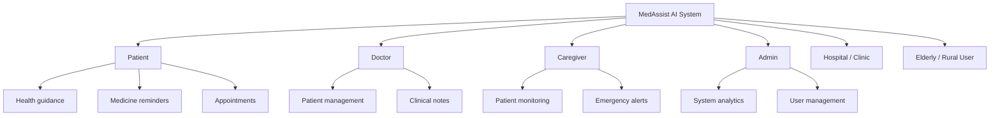
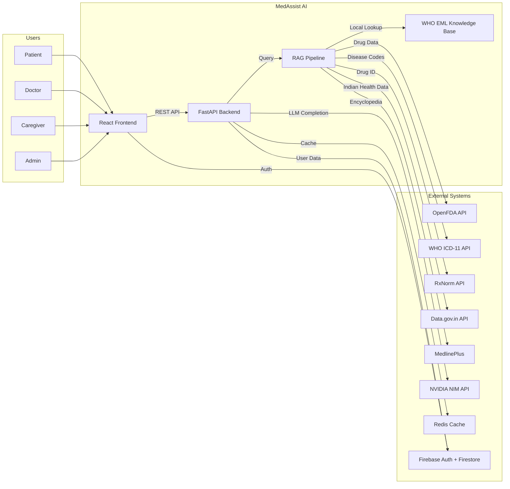
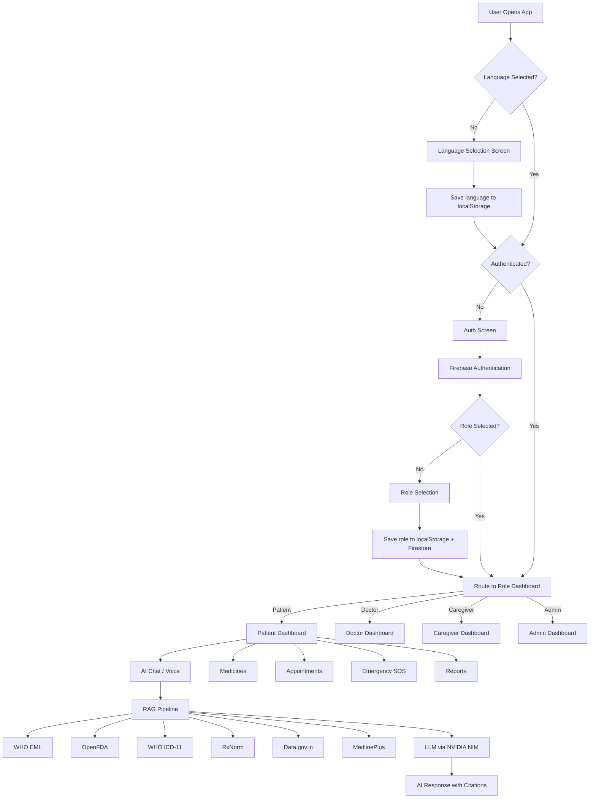
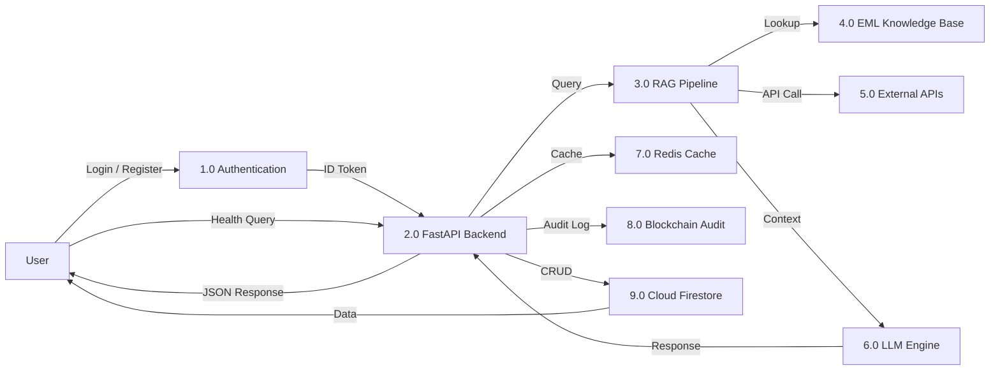

# MedAssist AI

## Software Requirements Specification / Project Requirements Document

### Final 100/100 SRS Schema

---

## Cover Page

| Field | Details |
|---|---|
| **Project Title** | MedAssist AI — Intelligent Multilingual Healthcare Assistant |
| **Theme** | AI-Powered Healthcare Accessibility for All |
| **Team Name** | MedAssist Development Team |
| **Document Type** | Software Requirements Specification (SRS) / Project Requirements Document (PRD) |
| **Version** | 2.0.0 |
| **Prepared By** | MedAssist AI Engineering Team |
| **Reviewed By** | Project Lead & Faculty Advisor |
| **Institution / Organization** | Academic Capstone / Independent Development |
| **Submission Date** | July 2026 |

---

## Document Control

### Version History

| Version | Date | Author | Description |
|---|---|---|---|
| 1.0.0 | May 2026 | Development Team | Initial SRS document with core feature definitions |
| 1.5.0 | June 2026 | Development Team | Added RAG pipeline, external API integrations, multilingual support |
| 2.0.0 | July 2026 | Development Team | Enterprise upgrade — WHO ICD-11 API, EML knowledge base, modular backend architecture, RBAC, audit trails |

### Approval Details

| Role | Name | Signature | Date |
|---|---|---|---|
| Project Lead | — | — | — |
| Faculty Advisor | — | — | — |
| Quality Reviewer | — | — | — |

---

## Table of Contents

1. [Introduction](#1-introduction)
2. [Executive Summary](#2-executive-summary)
3. [Problem Statement](#3-problem-statement)
4. [Existing System](#4-existing-system)
5. [Proposed System](#5-proposed-system)
6. [Stakeholders and User Roles](#6-stakeholders-and-user-roles)
7. [Project Scope](#7-project-scope)
8. [System Features](#8-system-features)
9. [Functional Requirements](#9-functional-requirements)
10. [Non-Functional Requirements](#10-non-functional-requirements)
11. [Technology and API Requirements](#11-technology-and-api-requirements)
12. [Data Requirements](#12-data-requirements)
13. [Requirement Diagrams](#13-requirement-diagrams)
14. [Assumptions, Constraints, and Dependencies](#14-assumptions-constraints-and-dependencies)
15. [Security and Medical Safety Requirements](#15-security-and-medical-safety-requirements)
16. [Acceptance Criteria](#16-acceptance-criteria)
17. [References](#17-references)
18. [Appendix](#18-appendix)

---

# 1. Introduction

## 1.1 Purpose of the Document

This Software Requirements Specification (SRS) document provides a complete and detailed description of the functional, non-functional, and technical requirements for the **MedAssist AI** application. It serves as the single source of truth for the development team, project stakeholders, and evaluators to understand the scope, architecture, user roles, system behaviors, and acceptance criteria of the system.

This document is prepared in accordance with IEEE 830-1998 SRS standards and is intended to achieve a comprehensive, production-grade specification covering every module of the application.

## 1.2 Intended Audience

| Audience | Purpose |
|---|---|
| **Development Team** | Technical reference for frontend, backend, AI pipeline, and integration development |
| **Project Evaluators / Faculty** | Evaluation of project scope, feasibility, and academic rigor |
| **Quality Assurance Team** | Basis for test case development and acceptance testing |
| **System Architects** | Architectural decisions, technology stack validation, and scalability planning |
| **Healthcare Domain Experts** | Verification of medical safety, disclaimer compliance, and clinical appropriateness |
| **Future Maintainers** | Onboarding reference for understanding system design and module boundaries |

## 1.3 Scope of the Document

This document covers:

- All functional modules including Patient, Doctor, Caregiver, and Admin dashboards
- AI Chatbot and Voice Assistant powered by a Retrieval-Augmented Generation (RAG) pipeline
- External medical API integrations (OpenFDA, WHO ICD-11, RxNorm, Data.gov.in, MedlinePlus)
- Authentication, authorization, and role-based access control (RBAC)
- Multilingual support for 6 languages (English, Hindi, Tamil, Kannada, Malayalam, Telugu)
- Emergency SOS, medicine reminders, appointment management, and caregiver alerts
- Non-functional requirements including performance, security, scalability, and accessibility
- System architecture diagrams and data flow specifications

## 1.4 Product Scope

**MedAssist AI** is a multilingual, AI-powered healthcare assistant designed to bridge the healthcare accessibility gap for patients, doctors, caregivers, and healthcare administrators. The application provides:

- **Intelligent Medical Q&A** using a RAG pipeline backed by 6+ verified medical data sources
- **Role-based dashboards** for patients, doctors, caregivers, and administrators
- **Medicine management** including reminders, status tracking, and WHO Essential Medicines lookup
- **Appointment scheduling** between patients and doctors
- **Emergency SOS** with one-tap activation and caregiver/doctor notification
- **Voice assistant** with multilingual speech-to-text and text-to-speech capabilities
- **WhatsApp/SMS/IVR support channels** for users without smartphone access

The product targets healthcare facilities, rural health centers, elderly patients, and caregivers in India and other developing nations where language barriers and digital literacy gaps prevent effective use of existing healthcare technology.

## 1.5 Document Conventions

| Convention | Meaning |
|---|---|
| **SHALL** | Mandatory requirement — must be implemented |
| **SHOULD** | Recommended requirement — implement if feasible |
| **MAY** | Optional requirement — implement at team discretion |
| **FR-XXX** | Functional Requirement identifier |
| **NFR-XXX** | Non-Functional Requirement identifier |
| **Bold text** | Key terms, module names, or emphasis |
| `Code formatting` | File names, API endpoints, configuration keys, or code references |

## 1.6 Definitions, Acronyms, and Abbreviations

| Term | Definition |
|---|---|
| **AI** | Artificial Intelligence |
| **API** | Application Programming Interface |
| **CORS** | Cross-Origin Resource Sharing |
| **CRUD** | Create, Read, Update, Delete |
| **EML** | WHO Essential Medicines List |
| **FHIR** | Fast Healthcare Interoperability Resources |
| **HL7** | Health Level Seven International |
| **ICD-11** | International Classification of Diseases, 11th Revision |
| **IVR** | Interactive Voice Response |
| **JWT** | JSON Web Token |
| **LLM** | Large Language Model |
| **LOINC** | Logical Observation Identifiers Names and Codes |
| **MMS** | Mortality and Morbidity Statistics (ICD-11 linearization) |
| **NFR** | Non-Functional Requirement |
| **OAuth2** | Open Authorization 2.0 |
| **RAG** | Retrieval-Augmented Generation |
| **RBAC** | Role-Based Access Control |
| **REST** | Representational State Transfer |
| **RxCUI** | RxNorm Concept Unique Identifier |
| **SNOMED CT** | Systematized Nomenclature of Medicine — Clinical Terms |
| **SOS** | Emergency distress signal |
| **SPA** | Single Page Application |
| **SRS** | Software Requirements Specification |
| **TTS** | Text-to-Speech |
| **WHO** | World Health Organization |

## 1.7 References

| # | Reference | URL / Source |
|---|---|---|
| 1 | IEEE 830-1998 SRS Standard | IEEE Standards Association |
| 2 | React 19 Documentation | https://react.dev |
| 3 | FastAPI Documentation | https://fastapi.tiangolo.com |
| 4 | Firebase Documentation | https://firebase.google.com/docs |
| 5 | OpenFDA API Documentation | https://open.fda.gov/apis |
| 6 | WHO ICD-11 API Documentation | https://icd.who.int/icdapi |
| 7 | RxNorm API Documentation | https://rxnav.nlm.nih.gov/RxNormAPIs.html |
| 8 | Data.gov.in API Portal | https://data.gov.in |
| 9 | MedlinePlus Health Topics | https://medlineplus.gov |
| 10 | NVIDIA NIM API (LLM hosting) | https://build.nvidia.com |

---

# 2. Executive Summary

## 2.1 Project Overview

MedAssist AI is an enterprise-grade, multilingual healthcare assistant application that combines a modern React-based frontend with a FastAPI backend powered by a Retrieval-Augmented Generation (RAG) pipeline. The system provides intelligent medical guidance to patients, workflow tools for doctors, monitoring capabilities for caregivers, and administrative oversight for healthcare facility managers.

The application integrates with 6+ verified external medical data sources — including the WHO Essential Medicines List (1,738 medicines), WHO ICD-11 Classification API, U.S. FDA OpenFDA drug database, RxNorm drug identification system, India's Data.gov.in public health datasets, and MedlinePlus medical encyclopedia — to ensure that every AI-generated response is grounded in authoritative, up-to-date medical knowledge rather than model hallucination.

## 2.2 Project Goal

To create an accessible, intelligent, and trustworthy healthcare assistant that:

1. **Eliminates language barriers** by supporting 6 Indian languages (English, Hindi, Tamil, Kannada, Malayalam, Telugu)
2. **Provides medically grounded AI responses** using RAG with verified data sources
3. **Empowers patients** with medicine reminders, appointment booking, symptom assessment, and emergency SOS
4. **Supports doctors** with patient management, appointment workflow, and adherence monitoring
5. **Protects caregivers** with real-time alerts, medicine status tracking, and emergency notifications
6. **Ensures safety** by never providing diagnosis or prescriptions, always recommending professional consultation

## 2.3 Business Value

| Value Dimension | Impact |
|---|---|
| **Healthcare Access** | Extends digital health services to rural, elderly, and non-English-speaking populations |
| **Patient Safety** | Emergency SOS with one-tap activation can reduce critical response times |
| **Medication Adherence** | Automated medicine reminders reduce missed doses by up to 40% (WHO estimate) |
| **Doctor Efficiency** | Centralized dashboard reduces appointment management overhead |
| **Caregiver Peace of Mind** | Real-time alerts for medicine compliance and emergencies |
| **Cost Reduction** | AI-powered first-line triage reduces unnecessary hospital visits |
| **Data-Driven Insights** | Admin analytics enable healthcare facility optimization |

## 2.4 Expected Outcome

Upon successful deployment, MedAssist AI will:

- Serve as a 24/7 multilingual health assistant accessible via web browser or mobile device
- Process medical queries with sub-3-second response times using cached RAG data
- Maintain a verified knowledge base of 1,738+ essential medicines with instant local lookup
- Provide WHO ICD-11 disease classification codes in real-time via authenticated API access
- Support 4 distinct user roles with role-specific dashboards and functionality
- Operate with zero medical diagnosis liability through consistent disclaimer enforcement
- Scale horizontally to support thousands of concurrent users via containerized deployment

---

# 3. Problem Statement

## 3.1 Current Healthcare Problem

Healthcare accessibility remains a critical challenge in developing nations, particularly in India, where:

- **Doctor-to-patient ratio** is approximately 1:1,445 (WHO recommends 1:1,000)
- **67% of the population** resides in rural areas with limited access to quality healthcare facilities
- **Digital literacy rates** are low among elderly populations who need healthcare services most
- **Language barriers** prevent effective communication between healthcare systems and patients who speak regional languages
- **Medication non-adherence** causes approximately 125,000 deaths annually in India alone

## 3.2 Hospital / Clinic Problem

- Appointment scheduling is often manual (phone-based or in-person), leading to long wait times and inefficient resource allocation
- Patient data is fragmented across paper records, making it difficult for doctors to access complete medical histories
- Emergency response coordination between hospitals, patients, and caregivers lacks a unified digital platform
- Healthcare staff spend significant time on administrative tasks that could be automated

## 3.3 Patient Pain Points

| Pain Point | Description |
|---|---|
| Language barrier | Healthcare apps are predominantly English-only; patients who speak Tamil, Hindi, Kannada, Malayalam, or Telugu are excluded |
| Digital illiteracy | Complex UIs with small text and multi-step workflows are inaccessible to elderly users |
| Medicine confusion | Patients forget dosages, timing, or interactions — leading to non-adherence |
| Emergency helplessness | During medical emergencies, patients may be unable to dial emergency numbers or communicate their location |
| Information overload | Unverified medical information from internet searches causes anxiety and misdiagnosis |
| Appointment friction | Booking, rescheduling, and tracking appointments requires multiple phone calls |

## 3.4 Caregiver Pain Points

- No real-time visibility into whether assigned patients have taken their medicines
- No automated alert when a patient triggers an emergency or misses critical medication
- Difficulty coordinating with multiple patients across different healthcare facilities
- Lack of historical reports on patient adherence and health trends

## 3.5 Healthcare Staff Pain Points

- Doctors lack a centralized dashboard to view patient queues, emergencies, and adherence metrics
- Admin staff have no system-wide analytics for monitoring facility performance
- Manual emergency triage is slow and error-prone
- No audit trail for medical interactions, creating compliance risks

---

# 4. Existing System

## 4.1 Current Healthcare Support Methods

| Method | Description |
|---|---|
| **In-person visits** | Patients physically visit clinics/hospitals for every query, regardless of severity |
| **Phone helplines** | Government helplines (104, 108) provide basic guidance but with long wait times |
| **Paper prescriptions** | Doctors write prescriptions on paper; patients lose or misread them |
| **WhatsApp groups** | Informal health advice shared in family/community groups — often unverified |
| **Generic health apps** | Apps like Practo, 1mg, and PharmEasy focus on doctor booking or medicine delivery but lack AI-powered medical guidance |

## 4.2 Existing Digital Healthcare Solutions

| Solution | Strengths | Weaknesses |
|---|---|---|
| **Practo** | Doctor discovery, appointment booking | No AI chatbot, limited language support, no caregiver features |
| **1mg / PharmEasy** | Medicine delivery, lab tests | E-commerce focused, no patient dashboard or emergency features |
| **Apollo 24/7** | Teleconsultation | Expensive, requires video capability, English-centric |
| **Aarogya Setu** | COVID tracking | Single-purpose, no ongoing health management |
| **Google Health** | Health information search | Generic results, no personalization, no multilingual Q&A |
| **Ada Health / Symptomate** | Symptom checker | English only, no Indian healthcare integration, no caregiver support |

## 4.3 Limitations of Existing System

### 4.3.1 Disconnected Platforms

Patients must use separate apps for doctor booking (Practo), medicine ordering (1mg), health information (Google), and emergency calls (phone dialer). There is no unified platform that integrates all healthcare needs into a single dashboard.

### 4.3.2 Lack of Personalization

Existing solutions provide generic health information without considering the patient's role, medical history, or preferred language. AI responses are not grounded in verified medical databases.

### 4.3.3 Internet Dependency

Most healthcare apps require continuous internet connectivity. Rural and low-bandwidth areas are effectively excluded. No existing solution provides offline-capable medicine reminders or cached health data.

### 4.3.4 Limited Multilingual Support

The vast majority of healthcare applications support only English and Hindi. Tamil, Kannada, Malayalam, and Telugu — spoken by over 300 million people combined — are rarely supported in healthcare technology.

### 4.3.5 Limited Support for Elderly and Rural Users

Existing apps use complex navigation, small fonts, and multi-step workflows that are inaccessible to elderly users. Features like voice assistant, high-contrast mode, and adjustable font sizes are absent.

---

# 5. Proposed System

## 5.1 Proposed Solution Overview

MedAssist AI is a unified, intelligent healthcare platform that consolidates patient management, doctor workflow, caregiver monitoring, and AI-powered medical guidance into a single, multilingual web application. The system is built on a modern React + FastAPI stack with a sophisticated RAG pipeline that retrieves authoritative medical data from multiple verified sources before generating any AI response.

## 5.2 How MedAssist AI Solves the Problem

| Problem | MedAssist AI Solution |
|---|---|
| Language barriers | 6-language support (EN, HI, TA, KN, ML, TE) with full UI translation and multilingual AI responses |
| Unverified medical info | RAG pipeline queries WHO EML, OpenFDA, ICD-11, RxNorm, Data.gov.in, and MedlinePlus before responding |
| Medicine non-adherence | Automated medicine reminders with status tracking and caregiver alerts |
| Emergency response delay | One-tap Emergency SOS with automatic caregiver/doctor notification |
| Disconnected platforms | Single dashboard integrating chat, appointments, medicines, emergencies, and reports |
| Digital illiteracy | Voice assistant, high-contrast mode, adjustable fonts, and simplified navigation for elderly users |
| Doctor workflow inefficiency | Dedicated doctor dashboard with patient queue, appointments, adherence metrics, and clinical notes |

## 5.3 Core Modules of the System

1. **Authentication & Role Management** — Firebase Authentication with 4 user roles
2. **Patient Dashboard** — Unified view of health metrics, medicines, appointments, and quick actions
3. **Doctor Dashboard** — Patient management, appointment workflow, adherence monitoring, clinical notes
4. **Caregiver Dashboard** — Patient monitoring, medicine status, alerts, emergency tracking
5. **Admin Dashboard** — System analytics, user management, reports, and facility monitoring
6. **AI Health Assistant** — Chat + Voice powered by RAG pipeline with 6 medical data sources
7. **Medicine Management** — Reminders, status tracking, WHO EML lookup, OpenFDA drug information
8. **Appointment System** — Patient booking, doctor management, status workflow
9. **Emergency SOS** — One-tap activation with location sharing and notification dispatch
10. **Notification Engine** — WhatsApp, SMS, IVR, and push notification support

## 5.4 Unique Value Proposition

| Feature | MedAssist AI | Competitors |
|---|---|---|
| **RAG-powered AI responses** | 6 verified medical data sources | Generic AI or no AI |
| **WHO ICD-11 integration** | Real-time disease classification | Not available |
| **WHO EML knowledge base** | 1,738 medicines with instant lookup | Not available |
| **6-language support** | EN, HI, TA, KN, ML, TE | English + Hindi max |
| **4 user roles** | Patient, Doctor, Caregiver, Admin | Usually patient-only |
| **Voice assistant** | Multilingual voice with GPT-OSS-120B | Limited or absent |
| **Emergency SOS** | One-tap with caregiver alerts | Requires phone call |
| **Caregiver monitoring** | Real-time medicine/emergency alerts | Not available |

## 5.5 Expected Benefits

1. **For Patients:** 24/7 health guidance in their native language, never miss a medicine dose, instant emergency help
2. **For Doctors:** Streamlined patient management, reduced administrative burden, better adherence visibility
3. **For Caregivers:** Peace of mind through real-time alerts, historical tracking, and emergency notification
4. **For Administrators:** System-wide analytics, user management, and compliance audit trails
5. **For Healthcare Ecosystem:** Reduced unnecessary hospital visits, improved medication adherence, data-driven decision making

---

# 6. Stakeholders and User Roles

## 6.1 Stakeholder Overview

## 6.2 Patient Role

- **Description:** Primary end-user who seeks health guidance, manages medicines, books appointments, and uses emergency features.
- **Access:** Patient Dashboard, AI Chat/Voice, Medicines, Appointments, Emergency SOS, Reports, Profile, WhatsApp/IVR Support, Medicine Search, Hospital Search, Settings
- **Permissions:** View own data, create appointments, trigger SOS, interact with AI, manage own profile and medicines

## 6.3 Doctor Role

- **Description:** Healthcare professional who manages assigned patients, views appointments, responds to emergencies, and tracks medication adherence.
- **Access:** Doctor Dashboard, Appointments, Emergencies, Patient List, Clinical Notes, Adherence Reports, Settings
- **Permissions:** View assigned patient data, update appointment status, write clinical notes, view adherence metrics

## 6.4 Caregiver Role

- **Description:** Family member or assigned caretaker who monitors a patient's health activities, medicine compliance, and emergency status.
- **Access:** Caregiver Dashboard, Patient Status, Medicine Status, Alerts, Appointments, Emergencies, Reports, Settings
- **Permissions:** View assigned patient data (read-only), receive alerts, view reports

## 6.5 Admin Role

- **Description:** System administrator who oversees the entire platform — managing users, viewing reports, monitoring alerts, and configuring system settings.
- **Access:** Admin Dashboard, All Patients, All Doctors, All Appointments, All Alerts, System Reports, Settings
- **Permissions:** Full CRUD on all system entities, user role management, system configuration

## 6.6 Hospital / Clinic Role

- **Description:** Institutional stakeholder that deploys MedAssist AI for their facility. Uses admin features for facility-level monitoring.
- **Relationship:** Represented through the Admin role in the current version. Future versions may include a dedicated Hospital role.

## 6.7 Elderly and Rural User Role

- **Description:** Special consideration user group that requires accessibility features — larger fonts, high contrast, voice interaction, and simplified navigation.
- **Relationship:** Typically uses the Patient role with accessibility settings enabled (font size adjustment, high-contrast mode, voice assistant as primary interaction method).

## 6.8 Role-Based Responsibilities

| Responsibility | Patient | Doctor | Caregiver | Admin |
|---|---|---|---|---|
| View own dashboard | Yes | Yes | Yes | Yes |
| AI Chat / Voice | Yes | No | No | No |
| Manage medicines | Yes | No | View only | View only |
| Book appointments | Yes | No | No | No |
| Manage appointments | No | Yes | No | Yes |
| Trigger Emergency SOS | Yes | No | No | No |
| View emergencies | No | Yes | Yes | Yes |
| View patient data | Own only | Assigned | Assigned | All |
| Manage users | No | No | No | Yes |
| View system reports | No | No | No | Yes |

---

# 7. Project Scope

## 7.1 In Scope

### 7.1.1 User Registration and Login

Firebase Authentication with email/password sign-up, role selection (Patient, Doctor, Caregiver, Admin), and persistent session management via Firebase ID tokens.

### 7.1.2 Language Selection

Initial language selection screen with 6 supported languages: English, Hindi, Tamil, Kannada, Malayalam, and Telugu. Language preference is persisted in localStorage and applied across all UI strings and AI responses.

### 7.1.3 Patient Dashboard

Unified dashboard displaying health score, today's medicines, upcoming appointments, quick action cards (Chat, Voice, Emergency, Medicines, Appointments, Reports, Hospital Finder, Medicine Search), and recent activity feed.

### 7.1.4 Doctor Dashboard

Dashboard showing today's appointments, active patients, pending emergencies, recent patient activity, and quick navigation to patient management, notes, and adherence reports.

### 7.1.5 Caregiver Dashboard

Dashboard displaying assigned patient status, medicine compliance summary, active alerts, emergency notifications, and navigation to detailed patient views.

### 7.1.6 Admin Dashboard

System-wide analytics dashboard with total users, active patients, today's appointments, pending alerts, and navigation to user management, reports, and settings.

### 7.1.7 Medicine Reminder

Patient can add, edit, and delete medicine schedules with dosage, timing (morning/afternoon/evening/night), start date, and end date. System marks medicines as taken/missed and sends reminder notifications.

### 7.1.8 Appointment Management

Patients book appointments with available doctors by selecting date, time, and providing reason. Doctors view, accept, or cancel appointments. Both parties see appointment status (Pending, Confirmed, Completed, Cancelled).

### 7.1.9 AI Chatbot

Text-based conversational interface where patients ask health questions. The system retrieves relevant medical data from the RAG pipeline (WHO EML, OpenFDA, ICD-11, RxNorm, Data.gov.in, MedlinePlus) and generates a contextual, multilingual response using an LLM. Responses include source citations and a medical disclaimer.

### 7.1.10 Voice Assistant

Speech-to-text interface using OpenAI Whisper API for multilingual voice input. The transcribed text is processed through the same RAG pipeline as the chatbot, and the response is delivered as text with optional text-to-speech output using the GPT-OSS-120B model.

### 7.1.11 Symptom Checker

Patients describe symptoms in natural language (text or voice). The AI assistant provides general guidance based on WHO ICD-11 disease classification data and recommends consulting a doctor. Does not provide diagnosis.

### 7.1.12 Medicine Information Lookup

Dedicated search page where patients can look up any medicine by name. The system queries OpenFDA for drug labels, warnings, dosage information, and adverse reactions, and the WHO EML knowledge base for WHO classification and formulation data.

### 7.1.13 Doctor / Hospital Finder

Search interface for finding nearby hospitals. Queries Data.gov.in Hospital Directory for Indian hospital listings with state-based filtering.

### 7.1.14 Emergency SOS

One-tap emergency activation that records the emergency event with timestamp and optional location, sends immediate notification to assigned caregivers and doctors, displays emergency contact numbers and nearest hospital information, and logs the event in the audit trail.

### 7.1.15 WhatsApp / SMS / IVR Alerts

Support channel page providing WhatsApp integration for health tips and reminders, SMS gateway for medicine alerts, and IVR (Interactive Voice Response) for phone-based health guidance for users without smartphones.

### 7.1.16 Caregiver Alerts

Real-time notification system that alerts caregivers when a patient misses a medicine dose, triggers an Emergency SOS, or when appointment status changes.

### 7.1.17 Admin Monitoring

System-wide monitoring including user registration and activity metrics, appointment volume and status distribution, emergency event tracking and response times, API usage logs and error rates, and system health and performance metrics.

## 7.2 Out of Scope

### 7.2.1 Direct Medical Diagnosis

The system SHALL NOT provide direct medical diagnosis. All AI responses include a disclaimer recommending professional consultation.

### 7.2.2 Medicine Purchase

The system does not include e-commerce functionality for purchasing medicines. It provides information and reminders only.

### 7.2.3 Insurance Claim Processing

Health insurance integration and claim processing are not included in the current scope.

### 7.2.4 Full Hospital ERP

The system is not a complete Hospital Enterprise Resource Planning solution. It focuses on patient-facing features and basic doctor/admin workflows.

### 7.2.5 Real-Time Ambulance Tracking

Live GPS tracking of ambulances is not included. The Emergency SOS provides contact information for emergency services.

### 7.2.6 Video Consultation in First Version

Live video telemedicine between patients and doctors is deferred to a future release.

### 7.2.7 Lab Report Automation in First Version

Automated lab report parsing, integration with laboratory information systems, and report visualization are deferred to a future release.

---

# 8. System Features

## 8.1 Authentication and Role Management

**Description:** Secure user authentication using Firebase Authentication with email/password credentials. Upon first login, users select their role (Patient, Doctor, Caregiver, Admin) which is persisted and determines their dashboard and permissions.

**Priority:** High

**Stimulus/Response:** User submits email + password -> Firebase validates credentials -> System retrieves/assigns role -> User is redirected to role-specific dashboard.

## 8.2 Language Selection

**Description:** First-time users are presented with a language selection screen supporting English, Hindi, Tamil, Kannada, Malayalam, and Telugu. The selected language is applied to all UI strings via JSON locale files and to AI response generation via language-specific prompts.

**Priority:** High

**Technical:** Locale files stored in `src/locales/` (en.json, hi.json, ta.json, kn.json, ml.json, te.json). Language preference stored in localStorage key `ma_lang`.

## 8.3 Patient Profile Management

**Description:** Patients can view and edit their profile including name, age, gender, blood group, allergies, chronic conditions, emergency contacts, and preferred language.

**Priority:** Medium

## 8.4 Medicine Reminder

**Description:** Patients add medicines with name, dosage, frequency (morning/afternoon/evening/night), start date, and end date. The system displays daily medicine schedules on the dashboard and tracks taken/missed status.

**Priority:** High

## 8.5 Appointment Management

**Description:** Two-sided appointment system. Patient side: Browse available doctors, select date/time, provide reason, and book appointment. Doctor side: View incoming appointments, confirm/reject/complete appointments. Status flow: Pending -> Confirmed -> Completed (or Cancelled at any stage).

**Priority:** High

## 8.6 AI Chatbot Assistance

**Description:** Conversational AI interface powered by the Meta Llama 3.1 8B Instruct model via NVIDIA NIM API. Before generating a response, the system retrieves relevant medical context from the RAG pipeline (6 data sources). The chatbot maintains conversation history (last 10 messages) for contextual responses.

**Priority:** Critical

**Data Sources in RAG Pipeline:**
1. WHO Essential Medicines List (local, 1,738 medicines)
2. OpenFDA Drug Labels and Adverse Events
3. RxNorm Drug Identification (RxCUI)
4. Data.gov.in Jan Aushadhi Generics + Hospital Directory
5. WHO ICD-11 Disease Classification (OAuth authenticated)
6. MedlinePlus / Wikipedia Medical Encyclopedia

## 8.7 Voice Assistant using Whisper

**Description:** Voice-based health interaction using OpenAI Whisper for speech-to-text conversion. Voice input is transcribed and processed through the same RAG pipeline as the chatbot. Uses the GPT-OSS-120B model (via NVIDIA NIM) for higher-quality reasoning on voice queries.

**Priority:** High

## 8.8 Symptom Checker

**Description:** Natural language symptom input (via chat or voice) that queries the WHO ICD-11 API for disease classification matches and provides general health guidance. Always includes a recommendation to consult a doctor.

**Priority:** Medium

## 8.9 Medicine Information Lookup

**Description:** Dedicated search interface for looking up medicine information. Queries OpenFDA for drug labels, warnings, and indications, and the local WHO EML knowledge base for WHO classification, formulations, and ATC codes.

**Priority:** Medium

## 8.10 Doctor / Hospital Finder

**Description:** Search interface for finding hospitals, currently querying Data.gov.in Hospital Directory with state-based filtering for Indian hospitals.

**Priority:** Medium

## 8.11 Emergency SOS

**Description:** One-tap emergency activation from the patient dashboard. Records the event, notifies assigned caregivers and doctors, displays emergency contact information, and logs the event for audit.

**Priority:** Critical

## 8.12 WhatsApp Support

**Description:** WhatsApp Business API integration for sending health tips, medicine reminders, and appointment notifications to patients via WhatsApp.

**Priority:** Medium

## 8.13 SMS Support

**Description:** SMS gateway integration for medicine reminders and emergency notifications for users without smartphones or internet access.

**Priority:** Medium

## 8.14 IVR Support

**Description:** Interactive Voice Response system for phone-based health guidance, enabling users to interact with the health assistant via a phone call without internet.

**Priority:** Low

## 8.15 Caregiver Alert System

**Description:** Real-time notification dispatch to caregivers for medicine compliance events, emergency SOS triggers, and appointment status changes.

**Priority:** High

## 8.16 Doctor Module

**Description:** Comprehensive doctor workspace including patient list with health summaries, appointment management with status workflow, clinical notes per patient, medicine adherence monitoring, and emergency case viewing.

**Priority:** High

## 8.17 Admin Module

**Description:** System administration workspace including user management (all roles), system-wide analytics and metrics, appointment oversight, alert monitoring, doctor management, and system settings and configuration.

**Priority:** High

## 8.18 Notification Management

**Description:** Centralized notification service supporting Firebase Cloud Messaging (push), WhatsApp Business API, SMS gateway, and IVR gateway for multi-channel alert delivery.

**Priority:** Medium

## 8.19 Chat History Management

**Description:** Persistent storage and retrieval of AI chat conversations per user session, enabling contextual follow-up questions and historical review.

**Priority:** Medium

## 8.20 API Log Management

**Description:** Audit logging of all API requests with timestamp, user ID, endpoint, and response status. Logged via the blockchain audit service for immutability.

**Priority:** Medium

---

# 9. Functional Requirements

## 9.1 Authentication Requirements

| ID | Requirement | Priority |
|---|---|---|
| FR-AUTH-001 | The system SHALL allow users to register with email and password via Firebase Authentication | High |
| FR-AUTH-002 | The system SHALL allow users to log in with existing email and password credentials | High |
| FR-AUTH-003 | The system SHALL require role selection (Patient, Doctor, Caregiver, Admin) during first login | High |
| FR-AUTH-004 | The system SHALL persist the user's role in localStorage (ma_role) | High |
| FR-AUTH-005 | The system SHALL redirect authenticated users to their role-specific dashboard | High |
| FR-AUTH-006 | The system SHALL redirect unauthenticated users to the login page | High |
| FR-AUTH-007 | The system SHALL prevent users from accessing dashboards of other roles | High |
| FR-AUTH-008 | The system SHALL provide a logout function that clears the session | Medium |

## 9.2 Language Selection Requirements

| ID | Requirement | Priority |
|---|---|---|
| FR-LANG-001 | The system SHALL display a language selection screen on first visit | High |
| FR-LANG-002 | The system SHALL support English, Hindi, Tamil, Kannada, Malayalam, and Telugu | High |
| FR-LANG-003 | The system SHALL persist the selected language in localStorage (ma_lang) | High |
| FR-LANG-004 | The system SHALL apply the selected language to all UI text using locale JSON files | High |
| FR-LANG-005 | The system SHALL instruct the AI to respond in the user's selected language | High |
| FR-LANG-006 | The system SHALL allow users to change language from settings | Medium |

## 9.3 Patient Profile Requirements

| ID | Requirement | Priority |
|---|---|---|
| FR-PROF-001 | The system SHALL display the patient's profile with personal and medical information | High |
| FR-PROF-002 | The system SHALL allow patients to edit their name, age, gender, blood group, allergies, and chronic conditions | High |
| FR-PROF-003 | The system SHALL allow patients to add emergency contact information | High |
| FR-PROF-004 | The system SHALL store profile data in Cloud Firestore | High |

## 9.4 Medicine Reminder Requirements

| ID | Requirement | Priority |
|---|---|---|
| FR-MED-001 | The system SHALL allow patients to add medicines with name, dosage, and schedule | High |
| FR-MED-002 | The system SHALL display today's medicine schedule on the patient dashboard | High |
| FR-MED-003 | The system SHALL allow patients to mark a medicine as taken or missed | High |
| FR-MED-004 | The system SHALL send reminder notifications at scheduled medicine times | High |
| FR-MED-005 | The system SHALL allow patients to edit or delete existing medicine schedules | Medium |
| FR-MED-006 | The system SHALL support start date and end date for time-limited prescriptions | Medium |

## 9.5 Medicine Status Tracking Requirements

| ID | Requirement | Priority |
|---|---|---|
| FR-MSTAT-001 | The system SHALL record each medicine taken/missed event with timestamp | High |
| FR-MSTAT-002 | The system SHALL display adherence percentage on the patient dashboard | Medium |
| FR-MSTAT-003 | The system SHALL make medicine status visible to assigned caregivers | High |
| FR-MSTAT-004 | The system SHALL make adherence reports visible to assigned doctors | Medium |

## 9.6 Appointment Booking Requirements

| ID | Requirement | Priority |
|---|---|---|
| FR-APPT-001 | The system SHALL allow patients to book appointments with available doctors | High |
| FR-APPT-002 | The system SHALL require date, time, and reason for each appointment | High |
| FR-APPT-003 | The system SHALL display upcoming appointments on the patient dashboard | High |
| FR-APPT-004 | The system SHALL allow patients to cancel their own appointments | Medium |
| FR-APPT-005 | The system SHALL notify the doctor when a new appointment is booked | High |

## 9.7 Doctor Appointment Management Requirements

| ID | Requirement | Priority |
|---|---|---|
| FR-DAPPT-001 | The system SHALL display all appointments assigned to the doctor | High |
| FR-DAPPT-002 | The system SHALL allow doctors to confirm pending appointments | High |
| FR-DAPPT-003 | The system SHALL allow doctors to mark appointments as completed | High |
| FR-DAPPT-004 | The system SHALL allow doctors to cancel appointments with a reason | Medium |
| FR-DAPPT-005 | The system SHALL notify the patient when appointment status changes | High |

## 9.8 AI Chatbot Requirements

| ID | Requirement | Priority |
|---|---|---|
| FR-CHAT-001 | The system SHALL provide a text-based chat interface for medical queries | Critical |
| FR-CHAT-002 | The system SHALL query the RAG pipeline for medical context before generating responses | Critical |
| FR-CHAT-003 | The system SHALL use the WHO EML knowledge base as the primary data source | Critical |
| FR-CHAT-004 | The system SHALL query OpenFDA for drug label information | High |
| FR-CHAT-005 | The system SHALL query WHO ICD-11 for disease classification when relevant | High |
| FR-CHAT-006 | The system SHALL query RxNorm for drug identification | Medium |
| FR-CHAT-007 | The system SHALL respond in the user's selected language | High |
| FR-CHAT-008 | The system SHALL maintain conversation history (last 10 messages) for context | High |
| FR-CHAT-009 | The system SHALL include source citations in responses | High |
| FR-CHAT-010 | The system SHALL include a medical disclaimer in every response | Critical |
| FR-CHAT-011 | The system SHALL detect emergency keywords and flag the response accordingly | Critical |
| FR-CHAT-012 | The system SHALL NOT provide medical diagnosis or prescriptions | Critical |

## 9.9 Voice Assistant Requirements

| ID | Requirement | Priority |
|---|---|---|
| FR-VOICE-001 | The system SHALL accept voice input from the user's microphone | High |
| FR-VOICE-002 | The system SHALL transcribe voice to text using OpenAI Whisper API | High |
| FR-VOICE-003 | The system SHALL process transcribed text through the same RAG pipeline as the chatbot | High |
| FR-VOICE-004 | The system SHALL support multilingual voice input (6 languages) | High |
| FR-VOICE-005 | The system SHALL use GPT-OSS-120B model for voice query responses | High |
| FR-VOICE-006 | The system SHALL detect emergency keywords in voice transcriptions | Critical |

## 9.10 Symptom Checker Requirements

| ID | Requirement | Priority |
|---|---|---|
| FR-SYMP-001 | The system SHALL accept symptom descriptions in natural language | Medium |
| FR-SYMP-002 | The system SHALL query WHO ICD-11 for relevant disease classifications | Medium |
| FR-SYMP-003 | The system SHALL provide general guidance without diagnosis | Medium |
| FR-SYMP-004 | The system SHALL always recommend consulting a doctor | Critical |

## 9.11 Medicine Information Requirements

| ID | Requirement | Priority |
|---|---|---|
| FR-MINFO-001 | The system SHALL allow patients to search medicines by name | High |
| FR-MINFO-002 | The system SHALL display WHO EML classification, formulations, and ATC codes | High |
| FR-MINFO-003 | The system SHALL display OpenFDA drug label information (indications, warnings, dosage) | High |
| FR-MINFO-004 | The system SHALL display adverse event data from OpenFDA when available | Medium |
| FR-MINFO-005 | The system SHALL display generic medicine pricing from Data.gov.in Jan Aushadhi | Medium |

## 9.12 Doctor / Hospital Finder Requirements

| ID | Requirement | Priority |
|---|---|---|
| FR-HOSP-001 | The system SHALL allow users to search hospitals by state/location | Medium |
| FR-HOSP-002 | The system SHALL display hospital name, location, and contact information | Medium |
| FR-HOSP-003 | The system SHALL source hospital data from Data.gov.in Hospital Directory | Medium |

## 9.13 Emergency SOS Requirements

| ID | Requirement | Priority |
|---|---|---|
| FR-SOS-001 | The system SHALL provide a one-tap SOS activation button | Critical |
| FR-SOS-002 | The system SHALL record the emergency event with timestamp | Critical |
| FR-SOS-003 | The system SHALL notify assigned caregivers immediately | Critical |
| FR-SOS-004 | The system SHALL notify assigned doctors immediately | High |
| FR-SOS-005 | The system SHALL display emergency contact numbers | Critical |
| FR-SOS-006 | The system SHALL log the SOS event in the audit trail | High |

## 9.14 Caregiver Alert Requirements

| ID | Requirement | Priority |
|---|---|---|
| FR-CARE-001 | The system SHALL notify caregivers when a patient misses a medicine dose | High |
| FR-CARE-002 | The system SHALL notify caregivers when a patient triggers Emergency SOS | Critical |
| FR-CARE-003 | The system SHALL display patient medicine compliance status to caregivers | High |
| FR-CARE-004 | The system SHALL allow caregivers to view patient appointment history | Medium |

## 9.15 WhatsApp / SMS / IVR Notification Requirements

| ID | Requirement | Priority |
|---|---|---|
| FR-NOTIF-001 | The system SHALL support WhatsApp message delivery for health tips and reminders | Medium |
| FR-NOTIF-002 | The system SHALL support SMS delivery for medicine reminders | Medium |
| FR-NOTIF-003 | The system SHALL support IVR call delivery for users without smartphones | Low |
| FR-NOTIF-004 | The system SHALL allow users to configure their preferred notification channel | Medium |

## 9.16 Admin Management Requirements

| ID | Requirement | Priority |
|---|---|---|
| FR-ADMIN-001 | The system SHALL display system-wide user statistics on the admin dashboard | High |
| FR-ADMIN-002 | The system SHALL allow admins to view all registered patients | High |
| FR-ADMIN-003 | The system SHALL allow admins to view all registered doctors | High |
| FR-ADMIN-004 | The system SHALL allow admins to view all appointments across the system | High |
| FR-ADMIN-005 | The system SHALL allow admins to view all active alerts | High |
| FR-ADMIN-006 | The system SHALL provide system-wide reports and analytics | Medium |
| FR-ADMIN-007 | The system SHALL allow admins to configure system settings | Medium |

## 9.17 System Log Requirements

| ID | Requirement | Priority |
|---|---|---|
| FR-LOG-001 | The system SHALL log all AI chat interactions with timestamp and user ID | High |
| FR-LOG-002 | The system SHALL log all API requests to external medical services | Medium |
| FR-LOG-003 | The system SHALL log all authentication events (login, logout, role changes) | High |
| FR-LOG-004 | The system SHALL log all emergency SOS events | Critical |
| FR-LOG-005 | The system SHALL use blockchain-style audit logging for immutability | Medium |

---

# 10. Non-Functional Requirements

## 10.1 Performance Requirements

| ID | Requirement | Target |
|---|---|---|
| NFR-PERF-001 | AI chatbot response time | Less than 5 seconds for text responses with RAG context |
| NFR-PERF-002 | Page load time | Less than 2 seconds for initial page render |
| NFR-PERF-003 | EML knowledge base lookup | Less than 50 milliseconds (in-memory search) |
| NFR-PERF-004 | API proxy response time | Less than 3 seconds for external API passthrough |
| NFR-PERF-005 | Dashboard data load | Less than 1 second for Firestore document reads |
| NFR-PERF-006 | Redis cache hit rate | Greater than 80% for repeated medical queries |

## 10.2 Usability Requirements

| ID | Requirement |
|---|---|
| NFR-USE-001 | The system SHALL be usable by elderly users with minimal digital literacy |
| NFR-USE-002 | The system SHALL support adjustable font sizes for accessibility |
| NFR-USE-003 | The system SHALL support a high-contrast mode for visually impaired users |
| NFR-USE-004 | The system SHALL provide voice interaction as an alternative to text input |
| NFR-USE-005 | The system SHALL use consistent navigation patterns across all dashboards |
| NFR-USE-006 | The system SHALL display clear error messages in the user's selected language |

## 10.3 Reliability Requirements

| ID | Requirement |
|---|---|
| NFR-REL-001 | The system SHALL gracefully handle external API failures without crashing |
| NFR-REL-002 | The RAG pipeline SHALL return results from available sources even if some sources fail |
| NFR-REL-003 | The system SHALL continue operating without Redis (fail-open caching) |
| NFR-REL-004 | The system SHALL provide fallback responses when the LLM API is unavailable |

## 10.4 Availability Requirements

| ID | Requirement |
|---|---|
| NFR-AVAIL-001 | The system SHALL target 99.5% uptime for the backend API |
| NFR-AVAIL-002 | The system SHALL deploy the EML knowledge base locally to avoid single points of failure |
| NFR-AVAIL-003 | Firebase Authentication SHALL provide 99.95% availability (Google SLA) |

## 10.5 Scalability Requirements

| ID | Requirement |
|---|---|
| NFR-SCALE-001 | The backend SHALL support horizontal scaling via Docker containerization |
| NFR-SCALE-002 | The system SHALL support up to 1,000 concurrent users per instance |
| NFR-SCALE-003 | The Redis cache SHALL support distributed deployment for multi-instance scaling |
| NFR-SCALE-004 | Cloud Firestore SHALL auto-scale for database read/write operations |

## 10.6 Security Requirements

| ID | Requirement |
|---|---|
| NFR-SEC-001 | All API endpoints SHALL require Firebase Authentication tokens |
| NFR-SEC-002 | API keys for external services SHALL be stored in environment variables, never in source code |
| NFR-SEC-003 | CORS SHALL be configured to restrict origins in production deployment |
| NFR-SEC-004 | OAuth2 tokens for WHO ICD-11 API SHALL be cached securely and refreshed before expiry |
| NFR-SEC-005 | The system SHALL implement rate limiting (60 requests/minute per user) |
| NFR-SEC-006 | All network communication SHALL use HTTPS/TLS encryption |

## 10.7 Privacy Requirements

| ID | Requirement |
|---|---|
| NFR-PRIV-001 | Patient health data SHALL be accessible only to the patient, assigned doctor, and assigned caregiver |
| NFR-PRIV-002 | Chat conversation data SHALL not be shared with third parties |
| NFR-PRIV-003 | The system SHALL not store raw API keys in client-side code (except Firebase public config) |
| NFR-PRIV-004 | User data deletion requests SHALL be honored within 30 days |

## 10.8 Accessibility Requirements

| ID | Requirement |
|---|---|
| NFR-ACC-001 | The system SHALL support screen reader compatibility via semantic HTML |
| NFR-ACC-002 | The system SHALL support keyboard navigation for all interactive elements |
| NFR-ACC-003 | The system SHALL provide minimum 4.5:1 contrast ratio for text content |
| NFR-ACC-004 | The system SHALL support font size adjustment (stored in ma_fontsize) |
| NFR-ACC-005 | The system SHALL support high-contrast mode (stored in ma_contrast) |

## 10.9 Maintainability Requirements

| ID | Requirement |
|---|---|
| NFR-MAINT-001 | The backend SHALL follow a modular architecture (routers, services, RAG, security, database) |
| NFR-MAINT-002 | Configuration SHALL be centralized via Pydantic BaseSettings with .env file support |
| NFR-MAINT-003 | All external API integrations SHALL be isolated in dedicated service modules |
| NFR-MAINT-004 | The frontend SHALL use React Context API for state management |
| NFR-MAINT-005 | Code SHALL follow consistent naming conventions and include docstrings |

## 10.10 Compatibility Requirements

| ID | Requirement |
|---|---|
| NFR-COMPAT-001 | The frontend SHALL support Chrome, Firefox, Safari, and Edge (latest 2 versions) |
| NFR-COMPAT-002 | The frontend SHALL be responsive for desktop, tablet, and mobile viewports |
| NFR-COMPAT-003 | The backend SHALL run on Python 3.10+ |
| NFR-COMPAT-004 | The system SHALL support Docker deployment on Linux, macOS, and Windows |

## 10.11 Localization Requirements

| ID | Requirement |
|---|---|
| NFR-LOC-001 | The system SHALL support 6 languages: English, Hindi, Tamil, Kannada, Malayalam, Telugu |
| NFR-LOC-002 | All UI strings SHALL be externalized in JSON locale files |
| NFR-LOC-003 | The AI SHALL be instructed to respond in the user's selected language via system prompt |
| NFR-LOC-004 | New languages SHALL be addable by creating a new locale JSON file without code changes |

## 10.12 Medical Safety Requirements

| ID | Requirement |
|---|---|
| NFR-MEDSAFE-001 | The system SHALL NOT provide medical diagnoses |
| NFR-MEDSAFE-002 | The system SHALL NOT prescribe medicines |
| NFR-MEDSAFE-003 | Every AI response SHALL include a disclaimer recommending professional consultation |
| NFR-MEDSAFE-004 | Emergency keywords SHALL trigger immediate emergency flagging in responses |
| NFR-MEDSAFE-005 | The AI system prompt SHALL explicitly prohibit diagnostic and prescriptive behavior |

---

# 11. Technology and API Requirements

## 11.1 Frontend Technology

### 11.1.1 React 19

| Aspect | Details |
|---|---|
| **Framework** | React 19.2.6 |
| **Build Tool** | Vite 8.0.12 |
| **CSS Framework** | Tailwind CSS 4.3.1 |
| **Routing** | React Router DOM 7.18.0 |
| **State Management** | React Context API (AuthContext, LanguageContext) |
| **Animations** | Framer Motion 12.40.0 |
| **Icons** | Lucide React 1.21.0 |
| **Charts** | Recharts 3.8.1 |
| **Notifications** | React Hot Toast 2.6.0 |
| **Date Handling** | date-fns 4.4.0 |

## 11.2 Backend Technology

### 11.2.1 Firebase

| Aspect | Details |
|---|---|
| **Authentication** | Firebase Authentication (email/password) |
| **Database** | Cloud Firestore (NoSQL document database) |
| **Messaging** | Firebase Cloud Messaging (push notifications) |
| **Project ID** | medassist-ai-fc49b |

### 11.2.2 FastAPI

| Aspect | Details |
|---|---|
| **Framework** | FastAPI (Python 3.10+) |
| **ASGI Server** | Uvicorn |
| **Configuration** | Pydantic BaseSettings with .env file |
| **Architecture** | Modular: Routers, Services, RAG Pipeline, Security, Database |
| **API Documentation** | Auto-generated Swagger UI at /docs |
| **CORS** | Middleware with configurable origins |
| **Rate Limiting** | Redis-backed sliding window (60 req/min) |

## 11.3 Database Technology

### 11.3.1 Cloud Firestore

| Aspect | Details |
|---|---|
| **Type** | NoSQL document database |
| **Provider** | Google Firebase |
| **Collections** | users, patients, doctors, appointments, medicines, alerts, chats, sos_events, audit_logs |
| **Scalability** | Auto-scaling read/write capacity |
| **Real-time** | Real-time listeners for live data updates |

## 11.4 Authentication Technology

### 11.4.1 Firebase Authentication

| Aspect | Details |
|---|---|
| **Provider** | Google Firebase |
| **Method** | Email + Password |
| **Token Format** | Firebase ID Token (JWT-compatible) |
| **Backend Verification** | Firebase Admin SDK verifies ID tokens |
| **Session** | Persistent browser session with auto-refresh |
| **Role Storage** | localStorage (ma_role) + Firestore user document |

## 11.5 AI Chatbot Technology

### 11.5.1 OpenAI-Compatible 120B Large Language Model

| Aspect | Details |
|---|---|
| **Chat Model** | Meta Llama 3.1 8B Instruct (meta/llama-3.1-8b-instruct) |
| **Voice Model** | GPT-OSS 120B (openai/gpt-oss-120b) |
| **API Provider** | NVIDIA NIM (OpenAI-compatible endpoint) |
| **Base URL** | https://integrate.api.nvidia.com/v1 |
| **Max Tokens** | 4,096 per response |
| **Temperature** | 0.7 (chat), 1.0 (voice) |
| **RAG Integration** | Medical context injected into system prompt before LLM generation |

## 11.6 Voice and Multilingual Technology

### 11.6.1 Whisper

| Aspect | Details |
|---|---|
| **Technology** | OpenAI Whisper API |
| **API Key** | NVIDIA NIM Whisper endpoint |
| **Supported Languages** | English, Hindi, Tamil, Kannada, Malayalam, Telugu |
| **Input** | Browser microphone (MediaRecorder API) |
| **Output** | Transcribed text processed through RAG pipeline |

## 11.7 Notification Technology

### 11.7.1 Firebase Cloud Messaging

Push notifications for medicine reminders, appointment updates, and emergency alerts delivered to web browsers.

### 11.7.2 WhatsApp Business API

WhatsApp message delivery for health tips, reminders, and appointment confirmations. Requires WhatsApp Business API account.

### 11.7.3 SMS Gateway

SMS delivery for medicine reminders and emergency notifications via third-party SMS gateway (e.g., Twilio, MSG91).

### 11.7.4 IVR Gateway

Interactive Voice Response for phone-based health guidance. Deferred to future release for full implementation.

## 11.8 External Medical APIs

### 11.8.1 OpenFDA

| Aspect | Details |
|---|---|
| **Provider** | U.S. Food and Drug Administration |
| **Endpoints** | Drug Labels (/drug/label.json), Adverse Events (/drug/event.json) |
| **Authentication** | API key (OPENFDA_API_KEY) for higher rate limits |
| **Data** | Drug indications, warnings, dosage, contraindications, adverse event reports |
| **Rate Limit** | 240 requests/minute with API key |

### 11.8.2 RxNorm

| Aspect | Details |
|---|---|
| **Provider** | National Library of Medicine (NLM) |
| **Endpoints** | Drug lookup (/REST/drugs.json), Properties (/REST/rxcui/{id}/allProperties.json) |
| **Authentication** | None (free, open API) |
| **Data** | Drug identification (RxCUI), drug properties, synonyms |

### 11.8.3 DrugBank

| Aspect | Details |
|---|---|
| **Status** | Future Scope |
| **Data** | Comprehensive drug interaction data, pharmacology |
| **Note** | Requires academic or commercial license |

### 11.8.4 Infermedica

| Aspect | Details |
|---|---|
| **Status** | Future Scope |
| **Data** | Symptom checker with probabilistic diagnosis engine |
| **Note** | Commercial API, will supplement AI-based symptom checking |

### 11.8.5 ApiMedic

| Aspect | Details |
|---|---|
| **Status** | Future Scope |
| **Data** | Symptom-to-condition mapping API |

### 11.8.6 Practo / ABDM

| Aspect | Details |
|---|---|
| **Status** | Future Scope |
| **Data** | Doctor discovery, ABDM (Ayushman Bharat Digital Mission) health record integration |

### 11.8.7 WHO ICD

| Aspect | Details |
|---|---|
| **Provider** | World Health Organization |
| **API Version** | ICD-11 API v2 |
| **Token Endpoint** | https://icdaccessmanagement.who.int/connect/token |
| **API Base URL** | https://id.who.int/icd |
| **Authentication** | OAuth2 Client Credentials (Client ID + Client Secret) |
| **Data** | Disease classification codes, chapter hierarchy, search results |
| **Token Validity** | 3,600 seconds (1 hour), cached locally |
| **Search Endpoint** | /release/11/2024-01/mms/search |

### 11.8.8 MedlinePlus

| Aspect | Details |
|---|---|
| **Provider** | U.S. National Library of Medicine |
| **Data** | Medical encyclopedia for diseases, conditions, and procedures |
| **Authentication** | None (free, open access) |
| **Fallback** | Wikipedia medical articles when MedlinePlus returns no results |

### 11.8.9 SNOMED CT

| Aspect | Details |
|---|---|
| **Status** | Future Scope |
| **Data** | Clinical terminology for electronic health records |

### 11.8.10 LOINC — Future Scope

LOINC (Logical Observation Identifiers Names and Codes) for standardized lab report coding. Planned for lab report automation in future releases.

### 11.8.11 HL7 FHIR — Future Scope

HL7 FHIR (Fast Healthcare Interoperability Resources) for electronic health record interoperability. Planned for integration with hospital EHR systems in future releases.

---

# 12. Data Requirements

## 12.1 User Data Requirements

| Field | Type | Required | Description |
|---|---|---|---|
| uid | String | Yes | Firebase Authentication UID |
| email | String | Yes | User email address |
| displayName | String | Yes | User's full name |
| role | String | Yes | User role (patient/doctor/caregiver/admin) |
| language | String | Yes | Preferred language code (en/hi/ta/kn/ml/te) |
| createdAt | Timestamp | Yes | Account creation date |
| lastLogin | Timestamp | Yes | Last login timestamp |

## 12.2 Patient Health Data Requirements

| Field | Type | Required | Description |
|---|---|---|---|
| patientId | String | Yes | Reference to user UID |
| age | Number | No | Patient's age |
| gender | String | No | Patient's gender |
| bloodGroup | String | No | Blood group (A+, B-, O+, etc.) |
| allergies | Array of String | No | Known allergies |
| chronicConditions | Array of String | No | Chronic conditions (diabetes, hypertension, etc.) |
| emergencyContacts | Array of Object | No | Emergency contact name + phone |
| assignedDoctor | String | No | Reference to doctor user UID |
| assignedCaregiver | String | No | Reference to caregiver user UID |

## 12.3 Doctor Data Requirements

| Field | Type | Required | Description |
|---|---|---|---|
| doctorId | String | Yes | Reference to user UID |
| specialization | String | No | Medical specialization |
| hospital | String | No | Affiliated hospital name |
| experience | Number | No | Years of experience |
| assignedPatients | Array of String | No | List of assigned patient UIDs |

## 12.4 Caregiver Mapping Data Requirements

| Field | Type | Required | Description |
|---|---|---|---|
| caregiverId | String | Yes | Reference to caregiver user UID |
| assignedPatients | Array of String | Yes | List of patient UIDs under care |
| relationship | String | No | Relationship to patient (spouse, child, sibling, etc.) |
| alertPreferences | Object | No | Notification channel preferences (push, SMS, WhatsApp) |

## 12.5 Medicine Schedule Data Requirements

| Field | Type | Required | Description |
|---|---|---|---|
| medicineId | String | Yes | Auto-generated document ID |
| patientId | String | Yes | Reference to patient UID |
| name | String | Yes | Medicine name |
| dosage | String | Yes | Dosage (e.g., 500mg) |
| schedule | Array of String | Yes | Timing array (morning/afternoon/evening/night) |
| startDate | Date | Yes | Prescription start date |
| endDate | Date | No | Prescription end date |
| isActive | Boolean | Yes | Whether the schedule is currently active |

## 12.6 Medicine Log Data Requirements

| Field | Type | Required | Description |
|---|---|---|---|
| logId | String | Yes | Auto-generated document ID |
| medicineId | String | Yes | Reference to medicine schedule |
| patientId | String | Yes | Reference to patient UID |
| status | String | Yes | taken or missed |
| timestamp | Timestamp | Yes | When the medicine was taken/missed |
| slot | String | Yes | Time slot (morning/afternoon/evening/night) |

## 12.7 Appointment Data Requirements

| Field | Type | Required | Description |
|---|---|---|---|
| appointmentId | String | Yes | Auto-generated document ID |
| patientId | String | Yes | Reference to patient UID |
| doctorId | String | Yes | Reference to doctor UID |
| date | Date | Yes | Appointment date |
| time | String | Yes | Appointment time |
| reason | String | Yes | Reason for visit |
| status | String | Yes | Pending / Confirmed / Completed / Cancelled |
| notes | String | No | Doctor's clinical notes post-visit |
| createdAt | Timestamp | Yes | Booking timestamp |

## 12.8 Chat History Data Requirements

| Field | Type | Required | Description |
|---|---|---|---|
| chatId | String | Yes | Auto-generated document ID |
| userId | String | Yes | Reference to user UID |
| messages | Array of Object | Yes | Array of role, text, timestamp objects |
| sessionStart | Timestamp | Yes | Chat session start time |
| language | String | Yes | Language used in this session |

## 12.9 SOS Event Data Requirements

| Field | Type | Required | Description |
|---|---|---|---|
| sosId | String | Yes | Auto-generated document ID |
| patientId | String | Yes | Reference to patient UID |
| timestamp | Timestamp | Yes | Emergency trigger time |
| location | GeoPoint | No | GPS coordinates if available |
| status | String | Yes | Active / Resolved |
| notifiedContacts | Array of String | No | UIDs of notified caregivers/doctors |
| resolvedAt | Timestamp | No | When the emergency was resolved |
| resolvedBy | String | No | UID of user who marked it resolved |

## 12.10 Notification Log Data Requirements

| Field | Type | Required | Description |
|---|---|---|---|
| notifId | String | Yes | Auto-generated document ID |
| recipientId | String | Yes | User UID of notification recipient |
| channel | String | Yes | push / sms / whatsapp / ivr |
| type | String | Yes | medicine_reminder / appointment / sos / alert |
| message | String | Yes | Notification content |
| sentAt | Timestamp | Yes | When notification was sent |
| delivered | Boolean | No | Delivery confirmation status |

## 12.11 API Log Data Requirements

| Field | Type | Required | Description |
|---|---|---|---|
| logId | String | Yes | Auto-generated document ID |
| eventType | String | Yes | CHAT_QUERY / VOICE_QUERY / API_PROXY / SOS_TRIGGER |
| userId | String | Yes | User who initiated the action |
| resource | String | Yes | Target resource/endpoint |
| timestamp | Timestamp | Yes | Event timestamp |
| blockHash | String | No | Blockchain-style hash for audit immutability |

**Note:** Detailed database schema will be submitted separately in the Database Design Document.

---

# 13. Requirement Diagrams

## 13.1 Use Case Diagram

```mermaid
graph TB
    subgraph "MedAssist AI System"
        UC1["Register / Login"]
        UC2["Select Language"]
        UC3["View Dashboard"]
        UC4["AI Chat"]
        UC5["Voice Assistant"]
        UC6["Manage Medicines"]
        UC7["Book Appointment"]
        UC8["Emergency SOS"]
        UC9["Search Medicines"]
        UC10["Find Hospitals"]
        UC11["View Reports"]
        UC12["Manage Appointments"]
        UC13["View Patients"]
        UC14["Write Clinical Notes"]
        UC15["Monitor Adherence"]
        UC16["View Alerts"]
        UC17["View Medicine Status"]
        UC18["Manage Users"]
        UC19["View System Analytics"]
        UC20["WhatsApp/SMS/IVR"]
    end

    P["Patient"] --> UC1
    P --> UC2
    P --> UC3
    P --> UC4
    P --> UC5
    P --> UC6
    P --> UC7
    P --> UC8
    P --> UC9
    P --> UC10
    P --> UC11
    P --> UC20

    D["Doctor"] --> UC1
    D --> UC3
    D --> UC12
    D --> UC13
    D --> UC14
    D --> UC15

    C["Caregiver"] --> UC1
    C --> UC3
    C --> UC16
    C --> UC17

    A["Admin"] --> UC1
    A --> UC3
    A --> UC18
    A --> UC19

    UC4 --> EXT1["RAG Pipeline"]
    UC5 --> EXT1
    EXT1 --> EXT2["WHO EML"]
    EXT1 --> EXT3["OpenFDA"]
    EXT1 --> EXT4["WHO ICD-11"]
    EXT1 --> EXT5["RxNorm"]
    EXT1 --> EXT6["Data.gov.in"]
    EXT1 --> EXT7["MedlinePlus"]
```

## 13.2 System Context Diagram

## 13.3 Requirement Flow Diagram

## 13.4 Data Flow Diagram — Level 0

## 13.5 Feature Breakdown Diagram

```mermaid
graph TD
    ROOT["MedAssist AI"] --> AUTH_MOD["Authentication and RBAC"]
    ROOT --> PATIENT_MOD["Patient Module"]
    ROOT --> DOCTOR_MOD["Doctor Module"]
    ROOT --> CAREGIVER_MOD["Caregiver Module"]
    ROOT --> ADMIN_MOD["Admin Module"]
    ROOT --> AI_MOD["AI Engine"]
    ROOT --> NOTIF_MOD["Notification Engine"]

    AUTH_MOD --> AUTH1["Firebase Auth"]
    AUTH_MOD --> AUTH2["Role Selection"]
    AUTH_MOD --> AUTH3["Protected Routes"]
    AUTH_MOD --> AUTH4["Session Management"]

    PATIENT_MOD --> P1["Dashboard"]
    PATIENT_MOD --> P2["Medicine Management"]
    PATIENT_MOD --> P3["Appointment Booking"]
    PATIENT_MOD --> P4["Emergency SOS"]
    PATIENT_MOD --> P5["Profile Management"]
    PATIENT_MOD --> P6["Reports"]
    PATIENT_MOD --> P7["Medicine Search"]
    PATIENT_MOD --> P8["Hospital Search"]

    DOCTOR_MOD --> D1["Dashboard"]
    DOCTOR_MOD --> D2["Appointment Management"]
    DOCTOR_MOD --> D3["Patient List"]
    DOCTOR_MOD --> D4["Clinical Notes"]
    DOCTOR_MOD --> D5["Adherence Monitoring"]
    DOCTOR_MOD --> D6["Emergency Cases"]

    CAREGIVER_MOD --> CG1["Dashboard"]
    CAREGIVER_MOD --> CG2["Patient Monitoring"]
    CAREGIVER_MOD --> CG3["Medicine Status"]
    CAREGIVER_MOD --> CG4["Alert Management"]
    CAREGIVER_MOD --> CG5["Emergency Tracking"]

    ADMIN_MOD --> AD1["Dashboard"]
    ADMIN_MOD --> AD2["User Management"]
    ADMIN_MOD --> AD3["System Reports"]
    ADMIN_MOD --> AD4["Doctor Management"]
    ADMIN_MOD --> AD5["Alert Monitoring"]

    AI_MOD --> AI1["RAG Pipeline"]
    AI_MOD --> AI2["Chat Interface"]
    AI_MOD --> AI3["Voice Assistant"]
    AI_MOD --> AI4["Symptom Checker"]

    AI1 --> SRC1["WHO EML - 1738 medicines"]
    AI1 --> SRC2["OpenFDA"]
    AI1 --> SRC3["WHO ICD-11"]
    AI1 --> SRC4["RxNorm"]
    AI1 --> SRC5["Data.gov.in"]
    AI1 --> SRC6["MedlinePlus"]

    NOTIF_MOD --> N1["Push via FCM"]
    NOTIF_MOD --> N2["WhatsApp"]
    NOTIF_MOD --> N3["SMS"]
    NOTIF_MOD --> N4["IVR"]
```

---

# 14. Assumptions, Constraints, and Dependencies

## 14.1 Assumptions

| # | Assumption |
|---|---|
| A-001 | Users have access to a modern web browser (Chrome, Firefox, Safari, or Edge) |
| A-002 | Users have a stable internet connection for initial load and AI queries |
| A-003 | Users can read at least one of the 6 supported languages |
| A-004 | Doctors and caregivers are registered and assigned to patients manually in the initial version |
| A-005 | The WHO ICD-11 API and OpenFDA API will remain publicly accessible with the same endpoints |
| A-006 | NVIDIA NIM API will continue to host the LLM models with OpenAI-compatible endpoints |
| A-007 | Firebase free tier is sufficient for the initial deployment scale |
| A-008 | Users understand that AI responses are informational, not diagnostic |

## 14.2 Constraints

| # | Constraint |
|---|---|
| C-001 | The system SHALL NOT provide medical diagnosis (regulatory constraint) |
| C-002 | The system SHALL NOT prescribe medicines (regulatory constraint) |
| C-003 | AI response quality is limited by the underlying LLM model capabilities |
| C-004 | External API availability is outside the system's control; fallback mechanisms are required |
| C-005 | Data.gov.in API has inconsistent response times (5-15 seconds) |
| C-006 | WHO ICD-11 API OAuth tokens expire after 3,600 seconds |
| C-007 | NVIDIA NIM API has rate limits based on API key tier |
| C-008 | WhatsApp Business API requires Meta business verification |
| C-009 | The existing UI SHALL NOT be modified (design freeze) |
| C-010 | Python 3.10 is the minimum supported backend version |

## 14.3 Dependencies

| # | Dependency | Type | Impact if Unavailable |
|---|---|---|---|
| D-001 | Firebase Authentication | Critical | Users cannot log in |
| D-002 | Cloud Firestore | Critical | No data persistence |
| D-003 | NVIDIA NIM API | High | AI chat and voice assistant unavailable |
| D-004 | OpenFDA API | Medium | Drug label data missing from RAG context |
| D-005 | WHO ICD-11 API | Medium | Disease classification data missing from RAG context |
| D-006 | RxNorm API | Low | Drug identification fallback unavailable |
| D-007 | Data.gov.in API | Low | Indian generic medicine and hospital data unavailable |
| D-008 | Redis | Low | Caching disabled; system operates without cache (fail-open) |
| D-009 | WHO EML Knowledge Base (local file) | High | Primary medicine lookup fails |

---

# 15. Security and Medical Safety Requirements

## 15.1 Authentication Safety

- All users SHALL authenticate via Firebase Authentication before accessing any protected feature
- Firebase ID tokens SHALL be validated on every API request via the get_current_user dependency
- Session tokens SHALL be automatically refreshed by the Firebase SDK
- Failed authentication attempts SHALL return HTTP 401 without leaking user existence information

## 15.2 Role-Based Access Control

- The system SHALL enforce role-based route protection via ProtectedRoute component
- Patients SHALL NOT access Doctor, Caregiver, or Admin dashboards
- Doctors SHALL NOT access Patient features (AI chat, medicine management, SOS)
- Role assignment SHALL be immutable after initial selection (admin-changeable only)

## 15.3 Patient Data Privacy

- Patient health data SHALL be accessible only to the patient, their assigned doctor, and their assigned caregiver
- Admin users MAY view aggregated patient data but SHALL NOT access individual chat conversations
- Data at rest in Firestore SHALL be encrypted by Google Cloud default encryption (AES-256)
- Data in transit SHALL be encrypted via TLS 1.2+

## 15.4 API Key Protection

- All external API keys SHALL be stored in server-side environment variables (.env file)
- API keys SHALL NOT be exposed in frontend JavaScript bundles
- The FastAPI backend SHALL act as a proxy for all external API calls, injecting keys server-side
- Firebase public configuration (apiKey, projectId) is safe for client-side use per Firebase documentation

## 15.5 Secure Communication

- All client-server communication SHALL use HTTPS
- All external API calls from the backend SHALL use HTTPS
- CORS configuration SHALL restrict origins to the application domain in production
- WebSocket connections (if used) SHALL use WSS (TLS-encrypted WebSocket)

## 15.6 AI Response Safety

- The AI system prompt SHALL explicitly instruct the LLM to never provide medical diagnosis, never prescribe medicines, always recommend consulting a doctor, respond in the user's selected language, and flag emergency keywords immediately
- The RAG pipeline SHALL source data only from verified medical databases
- AI responses SHALL include citations to the data sources used
- Emergency keyword detection SHALL operate independently of the LLM (rule-based, not AI-dependent)

## 15.7 Medical Disclaimer

The following disclaimer SHALL be enforced in the AI system prompt for every response:

> "MedAssist AI provides general health guidance only. It does not provide medical diagnosis or prescribe medicines. Always consult a qualified healthcare professional for medical advice. In case of emergency, contact your local emergency services immediately."

## 15.8 Emergency Safety Handling

- Emergency keywords (chest pain, breathing difficulty, unconscious, stroke, severe bleeding, accident, severe pain, suicidal) SHALL be detected in both user input and AI responses
- When emergency keywords are detected, the response SHALL include an emergency flag (emergency: true)
- The frontend SHALL display a prominent emergency warning when the flag is set
- Emergency SOS events SHALL be logged immutably in the audit trail

---

# 16. Acceptance Criteria

## 16.1 Login Acceptance Criteria

| # | Criteria | Expected Result |
|---|---|---|
| AC-LOGIN-001 | User enters valid email and password | User is authenticated and redirected to role dashboard |
| AC-LOGIN-002 | User enters invalid credentials | Error message displayed, no navigation |
| AC-LOGIN-003 | Unauthenticated user tries to access dashboard | Redirected to /auth page |
| AC-LOGIN-004 | User selects role on first login | Role is persisted and correct dashboard loads |

## 16.2 Language Selection Acceptance Criteria

| # | Criteria | Expected Result |
|---|---|---|
| AC-LANG-001 | User selects Tamil | All UI text changes to Tamil; AI responds in Tamil |
| AC-LANG-002 | User selects Hindi | All UI text changes to Hindi; AI responds in Hindi |
| AC-LANG-003 | Language persists across sessions | After browser close/reopen, language remains selected |

## 16.3 Medicine Reminder Acceptance Criteria

| # | Criteria | Expected Result |
|---|---|---|
| AC-MED-001 | Patient adds a morning medicine | Medicine appears in today's schedule under Morning |
| AC-MED-002 | Patient marks medicine as taken | Status updates to Taken with timestamp |
| AC-MED-003 | Patient misses marking medicine by end of slot | Status updates to Missed |
| AC-MED-004 | Caregiver views patient medicines | Caregiver sees same medicine list with taken/missed status |

## 16.4 Appointment Booking Acceptance Criteria

| # | Criteria | Expected Result |
|---|---|---|
| AC-APPT-001 | Patient books appointment | Appointment appears as Pending for both patient and doctor |
| AC-APPT-002 | Doctor confirms appointment | Status changes to Confirmed; patient is notified |
| AC-APPT-003 | Doctor completes appointment | Status changes to Completed |
| AC-APPT-004 | Patient cancels appointment | Status changes to Cancelled |

## 16.5 AI Chatbot Acceptance Criteria

| # | Criteria | Expected Result |
|---|---|---|
| AC-CHAT-001 | Patient asks "What is paracetamol?" | Response includes WHO EML data (indications, formulations, ATC code) and OpenFDA drug label info |
| AC-CHAT-002 | Patient asks about diabetes | Response includes ICD-11 codes (5A14, 5A11) and EML diabetes medicines |
| AC-CHAT-003 | Patient asks in Tamil | Response is entirely in Tamil |
| AC-CHAT-004 | Patient mentions "chest pain" | Response includes emergency flag and warning |
| AC-CHAT-005 | Response includes source citations | Sources (WHO EML, OpenFDA, ICD-11) listed at end of response |
| AC-CHAT-006 | Response includes medical disclaimer | Disclaimer text present in every response |

## 16.6 Voice Assistant Acceptance Criteria

| # | Criteria | Expected Result |
|---|---|---|
| AC-VOICE-001 | Patient speaks a health question | Voice is transcribed to text and processed |
| AC-VOICE-002 | Voice input in Hindi | Transcription is accurate; response in Hindi |
| AC-VOICE-003 | Voice mentions emergency keywords | Emergency flag is set in response |

## 16.7 Symptom Checker Acceptance Criteria

| # | Criteria | Expected Result |
|---|---|---|
| AC-SYMP-001 | Patient describes "fever and headache" | AI provides general guidance with ICD-11 relevant codes |
| AC-SYMP-002 | Response does not diagnose | Response says "consult a doctor" and does not name a specific diagnosis |

## 16.8 Emergency SOS Acceptance Criteria

| # | Criteria | Expected Result |
|---|---|---|
| AC-SOS-001 | Patient taps SOS button | Emergency event is recorded with timestamp |
| AC-SOS-002 | Caregiver receives alert | Caregiver dashboard shows active emergency for the patient |
| AC-SOS-003 | Emergency contacts displayed | Emergency phone numbers are visible on SOS screen |
| AC-SOS-004 | SOS event is logged | Audit trail contains SOS event with patient ID and timestamp |

## 16.9 Caregiver Alert Acceptance Criteria

| # | Criteria | Expected Result |
|---|---|---|
| AC-CARE-001 | Patient misses medicine | Caregiver receives notification of missed dose |
| AC-CARE-002 | Patient triggers SOS | Caregiver receives immediate emergency alert |
| AC-CARE-003 | Caregiver views medicine status | All assigned patient medicines visible with taken/missed status |

## 16.10 Admin Acceptance Criteria

| # | Criteria | Expected Result |
|---|---|---|
| AC-ADMIN-001 | Admin views dashboard | System-wide metrics displayed (total users, appointments, alerts) |
| AC-ADMIN-002 | Admin views all patients | Complete patient list with search and filter |
| AC-ADMIN-003 | Admin views all doctors | Complete doctor list |
| AC-ADMIN-004 | Admin views system reports | Analytics charts and data tables are rendered |

---

# 17. References

## 17.1 Medical API References

| # | API | URL | Usage |
|---|---|---|---|
| 1 | OpenFDA API | https://open.fda.gov/apis | Drug labels, adverse events |
| 2 | WHO ICD-11 API | https://icd.who.int/icdapi | Disease classification |
| 3 | WHO ICD-11 Swagger | https://id.who.int/swagger/index.html | API endpoint reference |
| 4 | RxNorm API | https://rxnav.nlm.nih.gov/RxNormAPIs.html | Drug identification |
| 5 | Data.gov.in | https://data.gov.in | Indian health datasets |
| 6 | MedlinePlus | https://medlineplus.gov | Medical encyclopedia |
| 7 | WHO Essential Medicines List | https://www.who.int/groups/expert-committee-on-selection-and-use-of-essential-medicines | Medicine reference data |

## 17.2 Technology References

| # | Technology | URL |
|---|---|---|
| 1 | React 19 | https://react.dev |
| 2 | Vite | https://vite.dev |
| 3 | Tailwind CSS 4 | https://tailwindcss.com |
| 4 | FastAPI | https://fastapi.tiangolo.com |
| 5 | Firebase | https://firebase.google.com |
| 6 | NVIDIA NIM | https://build.nvidia.com |
| 7 | Pydantic | https://docs.pydantic.dev |
| 8 | Redis | https://redis.io |
| 9 | Docker | https://www.docker.com |
| 10 | OpenAI Whisper | https://openai.com/research/whisper |

## 17.3 Project References

| # | Reference | Description |
|---|---|---|
| 1 | IEEE 830-1998 | IEEE Recommended Practice for Software Requirements Specifications |
| 2 | WHO Digital Health Guidelines | WHO recommendations for digital health interventions |
| 3 | India ABDM Framework | Ayushman Bharat Digital Mission architecture guidelines |
| 4 | HIPAA Guidelines | Health Insurance Portability and Accountability Act (reference for data privacy best practices) |

---

# 18. Appendix

## Appendix A: Functional Requirement ID List

| ID Range | Module |
|---|---|
| FR-AUTH-001 to FR-AUTH-008 | Authentication and Role Management |
| FR-LANG-001 to FR-LANG-006 | Language Selection |
| FR-PROF-001 to FR-PROF-004 | Patient Profile |
| FR-MED-001 to FR-MED-006 | Medicine Reminder |
| FR-MSTAT-001 to FR-MSTAT-004 | Medicine Status Tracking |
| FR-APPT-001 to FR-APPT-005 | Appointment Booking (Patient) |
| FR-DAPPT-001 to FR-DAPPT-005 | Appointment Management (Doctor) |
| FR-CHAT-001 to FR-CHAT-012 | AI Chatbot |
| FR-VOICE-001 to FR-VOICE-006 | Voice Assistant |
| FR-SYMP-001 to FR-SYMP-004 | Symptom Checker |
| FR-MINFO-001 to FR-MINFO-005 | Medicine Information |
| FR-HOSP-001 to FR-HOSP-003 | Hospital Finder |
| FR-SOS-001 to FR-SOS-006 | Emergency SOS |
| FR-CARE-001 to FR-CARE-004 | Caregiver Alerts |
| FR-NOTIF-001 to FR-NOTIF-004 | WhatsApp / SMS / IVR |
| FR-ADMIN-001 to FR-ADMIN-007 | Admin Management |
| FR-LOG-001 to FR-LOG-005 | System Logs |

**Total Functional Requirements: 87**

## Appendix B: Non-Functional Requirement ID List

| ID Range | Category |
|---|---|
| NFR-PERF-001 to NFR-PERF-006 | Performance |
| NFR-USE-001 to NFR-USE-006 | Usability |
| NFR-REL-001 to NFR-REL-004 | Reliability |
| NFR-AVAIL-001 to NFR-AVAIL-003 | Availability |
| NFR-SCALE-001 to NFR-SCALE-004 | Scalability |
| NFR-SEC-001 to NFR-SEC-006 | Security |
| NFR-PRIV-001 to NFR-PRIV-004 | Privacy |
| NFR-ACC-001 to NFR-ACC-005 | Accessibility |
| NFR-MAINT-001 to NFR-MAINT-005 | Maintainability |
| NFR-COMPAT-001 to NFR-COMPAT-004 | Compatibility |
| NFR-LOC-001 to NFR-LOC-004 | Localization |
| NFR-MEDSAFE-001 to NFR-MEDSAFE-005 | Medical Safety |

**Total Non-Functional Requirements: 56**

## Appendix C: API Reference List

| # | API Name | Type | Auth | Status |
|---|---|---|---|---|
| 1 | OpenFDA Drug Labels | REST | API Key | Active |
| 2 | OpenFDA Adverse Events | REST | API Key | Active |
| 3 | WHO ICD-11 Search | REST | OAuth2 | Active |
| 4 | WHO ICD-11 Entity | REST | OAuth2 | Active |
| 5 | RxNorm Drugs | REST | None | Active |
| 6 | RxNorm Properties | REST | None | Active |
| 7 | Data.gov.in Jan Aushadhi | REST | API Key | Active |
| 8 | Data.gov.in Hospitals | REST | API Key | Active |
| 9 | MedlinePlus | REST | None | Active |
| 10 | NVIDIA NIM LLM | REST | API Key | Active |
| 11 | NVIDIA NIM Whisper | REST | API Key | Active |
| 12 | Firebase Auth | SDK | Config | Active |
| 13 | Cloud Firestore | SDK | Config | Active |
| 14 | DrugBank | REST | License | Future |
| 15 | Infermedica | REST | API Key | Future |
| 16 | ApiMedic | REST | API Key | Future |
| 17 | SNOMED CT | REST | License | Future |
| 18 | LOINC | REST | License | Future |
| 19 | HL7 FHIR | REST | Varies | Future |

## Appendix D: Glossary

| Term | Definition |
|---|---|
| **ATC Code** | Anatomical Therapeutic Chemical classification code assigned by WHO to medicines |
| **Audit Trail** | Chronological record of system activities that provides evidence of operations performed |
| **Blockchain Audit** | Hash-chained audit log entries providing immutability guarantees |
| **Cloud Firestore** | Google's serverless NoSQL document database for mobile and web applications |
| **EML** | WHO Model List of Essential Medicines — the most effective and safe medicines for priority health conditions |
| **Fail-Open** | Design pattern where a system continues operating (with reduced functionality) when a dependency fails |
| **FastAPI** | Modern Python web framework for building APIs with automatic validation and documentation |
| **Firebase ID Token** | A JWT-compatible token issued by Firebase Authentication for authenticating API requests |
| **GeoPoint** | A geographic coordinate (latitude/longitude) stored in Firestore |
| **ICD-11** | The 11th revision of the International Classification of Diseases, the global standard for diagnostic health information |
| **Jan Aushadhi** | Indian government program providing quality generic medicines at affordable prices |
| **Linearization** | A tabular representation of the ICD-11 foundation component for specific use cases (e.g., MMS for mortality statistics) |
| **LLM** | Large Language Model — a deep learning model trained on vast text data for natural language understanding and generation |
| **MMS** | Mortality and Morbidity Statistics — the primary ICD-11 linearization used for coding |
| **NVIDIA NIM** | NVIDIA Inference Microservice — cloud platform for deploying and serving AI models |
| **OAuth2 Client Credentials** | An OAuth2 grant type where the application authenticates with its own credentials (client ID + secret) to access APIs |
| **RAG** | Retrieval-Augmented Generation — technique where relevant data is retrieved from external sources and injected into the LLM prompt |
| **Redis** | Open-source in-memory key-value store used for caching and rate limiting |
| **RxCUI** | RxNorm Concept Unique Identifier — a unique identifier for each drug concept in RxNorm |
| **Vite** | Next-generation frontend build tool with instant hot module replacement |

---

*End of Software Requirements Specification Document*

*MedAssist AI — Version 2.0.0 — July 2026*
