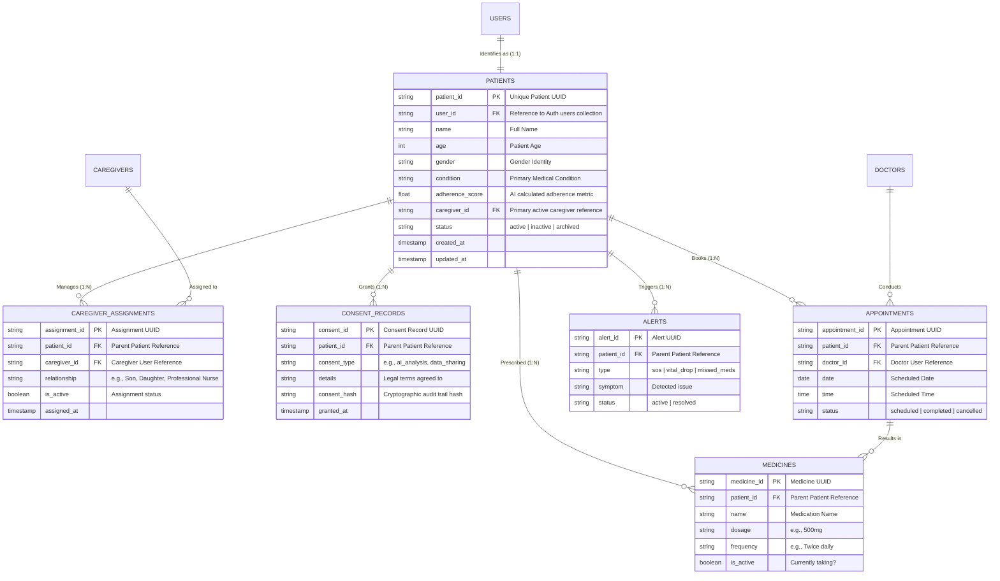
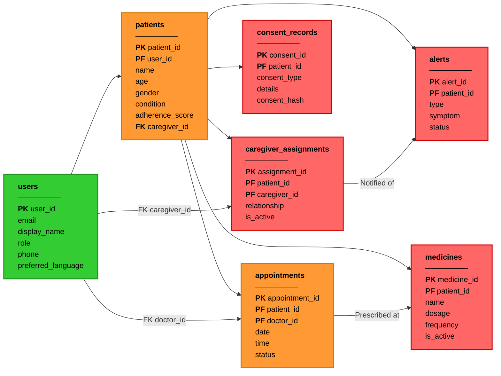
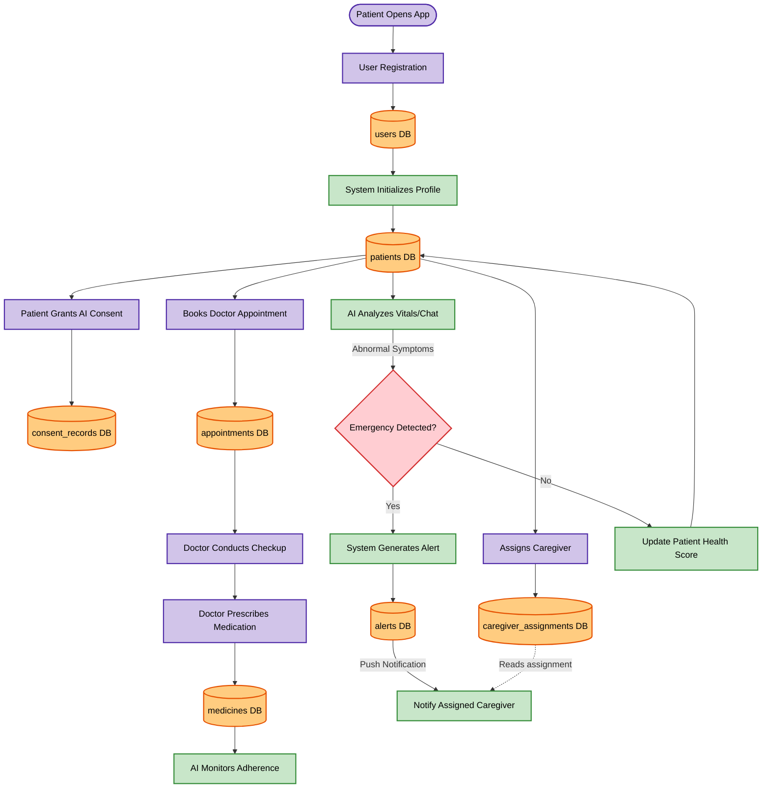

# MedAssist AI - Patient Database Design

## 1. Overview
This document defines the exact database architecture and schema for the **Patient Management Module**. It details the core `patients` entity and its deeply integrated sub-collections and references, including caregivers, consent records, clinical appointments, medications, and emergency alerts.

---

## 2. Entity-Relationship Diagram (ERD)

The following Mermaid ER Diagram maps out the exact structural relationships, keys, and cardinalities of the Patient ecosystem.

---

## 3. Visual Database Architecture (Image Style)

This flowchart natively renders the exact visual style and colors from the original design image within Markdown, mapping the tables, PK/FKs, and network connections.

---

## 4. Schema Definitions

### 4.1 `patients` (Core Collection)
The central repository for patient demographic and medical identity data.
*   **Access Control**: Read/Write by the Patient themselves. Read access granted to explicitly assigned Caregivers and Doctors.
*   **Indexes**: 
    *   `user_id` (Unique, for O(1) auth lookups)
    *   `caregiver_id` (For caregiver dashboard queries)

### 4.2 `caregiver_assignments` (Sub-collection)
Maps a patient to one or more caregivers.
*   **Access Control**: Read/Write by Patient. Read by the assigned Caregiver.
*   **Design Note**: Designed as a sub-collection under `patients` to ensure data locality and cascading deletes if a patient account is purged.

### 4.3 `consent_records` (Sub-collection)
Immutable ledger of legal and privacy consents granted by the patient.
*   **Security feature**: Includes a `consent_hash` to ensure data integrity and blockchain auditability for HIPAA/GDPR compliance.

### 4.4 `medicines` & `appointments` (Linked Collections)
Clinical data tracking the patient's medical history and future schedule.
*   **AI Integration**: The `medicines` collection heavily interacts with the AI agent to calculate the `adherence_score` stored on the root patient document.
*   **Workflow**: When an `appointment` is completed, new `medicines` are often generated by the Doctor.

### 4.5 `alerts` (Event Collection)
Emergency and notification triggers.
*   **Triggers**: When a new alert is inserted here, a backend Cloud Function automatically fires push notifications to the Patient's mapped `caregiver_id`.

---

## 4. Key Relationships & Cardinality

1.  **Users ↔ Patients (1:1)**: Every patient MUST map to exactly one authenticated identity in the `users` collection.
2.  **Patients ↔ Caregivers (1:N)**: A patient can have multiple caregivers (e.g., a son and a professional nurse), but a specific assignment record bridges them.
3.  **Patients ↔ Medical Data (1:N)**: All clinical data (appointments, meds, reports) is strictly scoped to the parent Patient ID to prevent cross-tenant data leaks.

---

## 5. Patient Data Flow & Workflow

This diagram illustrates the dynamic journey of a patient and how they interact with the database collections mapped out above.

---

## 6. Advanced Visualizations

For highly styled, interactive visual architectures of this schema, please refer to the generated local HTML files:
*   [patient_image_style_diagram.html](./patient_image_style_diagram.html) (Detailed visual schema matching custom layouts)
*   [detailed_patient_er_diagram.html](./detailed_patient_er_diagram.html) (Alternative Web ERD)
*   [patient_workflow_diagram.html](./patient_workflow_diagram.html) (Standalone Workflow Diagram)
